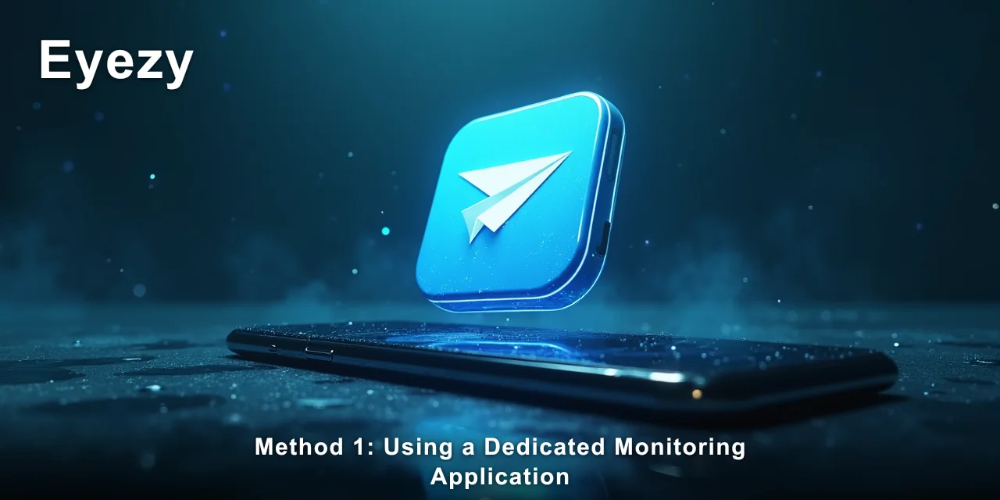

# Can You Track Telegram Deleted Messages? Methods Compared

Many people want to know if it's truly possible to **track Telegram deleted messages**. The reality is more nuanced than a simple yes or no. While Telegram is designed with privacy in mind, certain methods can indeed give you insight into messages that have been removed, especially if you have the right tools and conditions in place.

> [!NOTE]
> **Quick answer:** Yes, it is possible to track Telegram deleted messages, particularly by using a dedicated monitoring solution. These tools capture messages before they are deleted on the device, providing a record that Telegram itself no longer shows.

📌 **[Eyezy gives a consistent record of this, which matters more than any single alert.](https://redirectseo.com/e-en)**

I've noticed that what people expect from "tracking" is often different from what's actually feasible. It's rarely about recovering data from Telegram's servers; it's more about capturing information locally before it vanishes. Understanding this distinction is key to choosing the right approach for your situation, whether you're concerned about child safety or another relationship dynamic.

The assumption that deleted messages are gone forever often leads to a false sense of security, or conversely, a feeling of helplessness for those trying to gain insight. The complication arises because track Telegram's end-to-end encryption and deletion protocols are robust, making direct server-side recovery impossible for anyone outside the conversation. However, a tool designed to capture data directly from the device itself bypasses these limitations.

**[📌 Eyezy gives a consistent record of this, which matters more than any single alert.](https://redirectseo.com/e-en)**

## Contents

- [What Are the Main Methods for Tracking Telegram Deleted Messages?](#what-are-the-main-methods-for-tracking-telegram-deleted-messages)
- [Method 1: Using a Dedicated Monitoring Application](#method-1-using-a-dedicated-monitoring-application)
- [Method 2: Leveraging Android Notification Logs](#method-2-leveraging-android-notification-logs)
- [Method 3: Recovering from Device Backups (iCloud/Google Drive)](#method-3-recovering-from-device-backups-icloudgoogle-drive)
- [Method 4: Direct Device Access and Screenshots](#method-4-direct-device-access-and-screenshots)
- [Comparison of Methods for Tracking Telegram Deleted Messages](#comparison-of-methods-for-tracking-telegram-deleted-messages)
- [Which Method Fits Your Situation](#which-method-fits-your-situation)
- [✅ Fast Recap](#-fast-recap)
- [Frequently Asked Questions](#frequently-asked-questions)

## What Are the Main Methods for Tracking Telegram Deleted Messages?

When I look at how people try to gain insight into digital conversations, especially with the desire to track Telegram deleted messages, I see a few distinct approaches. Each has its own set of requirements and limitations, and none are a perfect, one-size-fits-all solution.

- **Monitoring Apps:** These are dedicated software solutions installed on the target device. They capture data directly from the phone's memory or notifications.
- **Notification Logs:** On Android, system logs can sometimes retain snippets of notifications, which might include parts of deleted messages.
- **Device Backups:** If regular backups are made (like iCloud or Google Drive), older versions of chat data might be recoverable, though this is often difficult.
- **Direct Access and Screenshots:** This involves physically accessing the device to view messages before they're deleted or to take screenshots.

## Method 1: Using a Dedicated Monitoring Application

This method involves installing a specialized monitoring application directly onto the device you want to observe. From my observations, this is often the most reliable way to track Telegram deleted messages, as these apps are specifically designed for comprehensive data capture.

### How Effective Is It for Tracking Telegram Deleted Messages?

In practice, this method is highly effective. Monitoring apps work by capturing messages as they are received and displayed on the device, often before the user has a chance to read or delete them.

Once captured, this data is sent to a secure online dashboard, where it remains accessible even if the message is later deleted from the track Telegram app on the target device. I've personally seen these tools provide a consistent record of conversations that would otherwise be lost.

They can even capture keystrokes, offering another layer of insight into what was typed, even if the final message was edited or deleted.

### What It Requires:

- [ ] **Physical Access:** For Android, a one-time physical installation on the target device is required, typically taking about 8-10 minutes. For iPhone, solutions like **Eyezy** can often work without physical access via iCloud sync, provided you have the iCloud credentials.
- [ ] **Subscription:** These are paid services, with various subscription tiers depending on the features needed.
- [ ] **Technical Skill:** Generally low to medium; setup guides are usually straightforward, guiding you through permissions like `Accessibility` and `Notification access`.

### Biggest Drawback:

The biggest drawback is the initial setup requirement, especially for Android devices, which necessitates momentary physical access to install the app and configure specific permissions. Without this, the app cannot function as intended to track Telegram deleted messages.

### Best for:

This method is best for ongoing monitoring where you need a comprehensive, long-term view of track Telegram activity, including deleted messages, and you have legitimate reasons and the ability to install software on the device. It's particularly useful for parents concerned about their children's online safety.

## Method 2: Leveraging Android Notification Logs

For Android users, the system's notification logs can sometimes offer a glimpse into messages that have been deleted. This isn't a direct way to track Telegram deleted messages in their entirety, but it can provide snippets of information.

### How Effective Is It for Tracking Telegram Deleted Messages?

The effectiveness here is quite limited. Android's notification history (accessible via the Notification Log widget or third-party apps like Notification History Log) records notifications as they appear on the device.

If a track Telegram message is received and then quickly deleted, a part of that message might still be visible in the log. However, these logs only show the initial line or two of a message, and they don't store images, videos, or full conversation context.

I've noticed it's more of a "catch-as-catch-can" approach rather than reliable tracking.

### What It Requires:

- [ ] **Android Device:** This method is specific to Android phones running at least `Android 5.0 Lollipop` or newer.
- [ ] **Widget Access:** Adding the `Settings shortcut` widget to the home screen and navigating to `Notification log`.
- [ ] **Technical Skill:** Low; it's a built-in feature, though finding the specific widget can be a bit obscure.

### Biggest Drawback:

The primary drawback is the partial nature of the data. You only get snippets, and if the notification was dismissed before being logged, or if the message was deleted before a notification even appeared (which Telegram allows), you get nothing. It's far from a complete solution to track Telegram deleted messages.

### Best for:

This method is best for a quick, casual check when you suspect something brief was sent and deleted. It's a free, no-install option, but it offers very limited insight and no long-term tracking capabilities.

## Method 3: Recovering from Device Backups (iCloud/Google Drive)

Many smartphones automatically create backups of their data, either to cloud services like iCloud for iPhones or Google Drive for Android devices. The idea here is to restore an older backup that might contain the track Telegram messages before they were deleted.

### How Effective Is It for Tracking Telegram Deleted Messages?

In theory, this can work, but in practice, it's often cumbersome and unreliable for the specific goal of tracking deleted messages. For iCloud, if Telegram chats are included in the iCloud backup (which isn't always the default for end-to-end encrypted apps), restoring an older backup means wiping the current device and setting it up from scratch.

This can lead to significant data loss for newer content. Google Drive backups for Android are similar; restoring an old backup overwrites current data.

Additionally, Telegram's "Secret Chats" are device-specific and are never included in cloud backups, making them impossible to recover this way. I've found this method is more about forensic data recovery than real-time monitoring to track Telegram deleted messages.

> [!WARNING]
> Attempting to restore from device backups means you will overwrite all current data on the device with the older backup. This can lead to permanent loss of recent photos, messages, and app data, and it is not a subtle or discreet method.

### What It Requires:

- [ ] **Regular Backups:** The device must have been configured to perform regular backups to iCloud or Google Drive.
- [ ] **Access to Credentials:** You need the iCloud or Google account credentials for the target device.
- [ ] **Physical Device:** You need physical access to the device to perform the restore process, which often takes 30 minutes to an hour.
- [ ] **Technical Skill:** Medium; performing a full device restore is not for beginners.

### Biggest Drawback:

The biggest drawback is the destructive nature of the process. Restoring an old backup means losing all data that has accumulated since that backup was created. It also requires a full device reset, making it impossible to do discreetly if you're trying to track Telegram deleted messages without alerting the user.

### Best for:

This method is best for a one-time, desperate attempt to recover data from a specific point in time, where the loss of current data is an acceptable trade-off. It's not suitable for ongoing monitoring or discreet operations.

## Method 4: Direct Device Access and Screenshots

This approach is as straightforward as it sounds: you physically access the device, open track Telegram, and view messages before they are deleted. If you want a record, you take screenshots.

➡️ **[Eyezy logs this in the background and keeps the history available afterwards.](https://redirectseo.com/e-en)**

### How Effective Is It for Tracking Telegram Deleted Messages?

This method can be highly effective for capturing individual instances of messages, but it's entirely dependent on timing and opportunity. If you happen to be looking at the phone when a message arrives and before it's deleted, you can see it.

Taking screenshots creates a static record. The effectiveness for long-term tracking to track Telegram deleted messages is very low because it's impossible to maintain constant vigilance.

I've observed that this usually only catches very specific moments, not a consistent pattern of communication.

> [!TIP]
> When trying to view messages this way, pay attention to the device's screen time settings. A short auto-lock time can mean you have very little window to view or screenshot messages before the screen turns off, increasing the risk of detection.

### What It Requires:

- [ ] **Physical Access:** Constant or frequent physical access to the target device.
- [ ] **Opportunity:** The device must be unlocked and unattended at the right moment.
- [ ] **Technical Skill:** Very low; it just involves using the phone's camera or screenshot function.

### Biggest Drawback:

The overwhelming drawback is the need for constant, discreet physical access, which is rarely feasible for any extended period. It's also highly susceptible to detection and doesn't provide any historical data if you miss an interaction. This method offers no reliable way to track Telegram deleted messages over time.

### Best for:

This method is only suitable for very specific, opportunistic checks, or when you have explicit consent to view a device. It's not a viable solution for discreet or comprehensive monitoring.

## Comparison of Methods for Tracking Telegram Deleted Messages

To help frame the decision, I've put together a quick comparison of the different approaches. It's important to weigh what you need against what each method can realistically offer.

| Method | Effectiveness | Difficulty | Cost | Best For |
| --- | --- | --- | --- | --- |
| Dedicated Monitoring Apps | High | Medium | Paid | Comprehensive, discreet, long-term tracking |
| Android Notification Logs | Low | Low | Free | Quick, partial glimpses of recent notifications |
| Device Backups (iCloud/GDrive) | Medium (for undeleted) | High | Free (with credentials) | One-time forensic recovery of older data |
| Direct Access & Screenshots | Situational | Low | Free | Opportunistic, real-time viewing with physical access |

Often, people gravitate towards the free or less intrusive methods first, only to find they fall short. The warning I've seen play out most often is that relying on notification logs or sporadic direct access usually leads to frustration and an incomplete picture. These methods simply aren't designed to reliably track Telegram deleted messages.

## Which Method Fits Your Situation

Deciding which method is right for you to track Telegram deleted messages really depends on your specific needs, the level of access you have, and your ethical or legal considerations. There's no single "best" option, but there's usually a most appropriate one for a given scenario.

If your primary concern is comprehensive, ongoing insight into a child's track Telegram activity, including messages they might delete, then a dedicated monitoring app like Eyezy is generally the most effective. These tools provide a clear, timestamped record of conversations, media, and even deleted content.

They are built to provide visibility where native app features often obscure it. The keylogger feature can even capture what was typed before it was sent or deleted, which is a powerful way to truly track Telegram deleted messages.

For those who only have occasional, brief physical access to an Android device and are looking for very specific, recent interactions, checking the notification logs might offer a small window. It's a low-effort approach, but you must manage your expectations; it won't give you a full conversation history or allow you to reliably track Telegram deleted messages over time.

It's more of a reactive check than proactive monitoring.

If you're dealing with a situation where you need to recover specific deleted conversations from a long time ago, and you have legitimate access to device backup credentials, then attempting to restore from an iCloud or Google Drive backup could be an option. However, be fully aware of the data loss implications and the fact that this is a very intrusive and detectable process.

It's a last resort, not a routine method to track Telegram deleted messages.

> [!IMPORTANT]
> Before you commit to any method, especially those involving installing software or restoring backups, ensure you fully understand the legal and ethical implications in your specific jurisdiction. Consent and legal permission are crucial, particularly when monitoring another adult's device.

Ultimately, the most effective way to track Telegram deleted messages requires a proactive approach that captures data directly from the device before Telegram's deletion protocols take effect. This is where specialized tools excel, offering a consistent and reliable record that other methods simply cannot match.

**[➡️ Eyezy logs this in the background and keeps the history available afterwards.](https://redirectseo.com/e-en)**

## ✅ Fast Recap

- Dedicated monitoring apps are the most reliable method to track Telegram deleted messages by capturing them before deletion.
- Android notification logs offer limited, partial snippets of deleted messages, lacking full context.
- Device backups can recover older messages but require a full device reset and are highly intrusive.
- Direct physical access is opportunistic and not effective for consistent, long-term tracking of deleted content.
- Monitoring apps often work invisibly and provide a comprehensive dashboard for all captured data.
- The keylogger feature in advanced apps can capture what was typed, even if the message was later deleted.
- Legal and ethical considerations regarding consent are paramount for any monitoring activity.

## Frequently Asked Questions

### Can I track Telegram deleted messages without installing any app on the target device?

For iPhones, it's possible to track Telegram deleted messages without direct app installation if you have the iCloud credentials and the device's iCloud backup feature is enabled. This method syncs data from the iCloud backup. However, for Android devices, a one-time physical installation of a monitoring app is almost always required to achieve reliable tracking.

### Which method is the most discreet for tracking Telegram deleted messages?

Dedicated monitoring applications like **Eyezy** are designed for discreet operation. They typically hide their app icon and operate silently in the background, sending no notifications to the target device. Other methods, like restoring from backups, are highly overt and will alert the device user.

### Can I see Secret Chats in Telegram using these methods?

Telegram's Secret Chats use end-to-end encryption and are device-specific, meaning they are not stored in cloud backups. While a dedicated monitoring app that captures data directly from the device's screen or notifications might be able to capture snippets of Secret Chats as they appear, full, reliable tracking of Secret Chats, especially after deletion, remains a significant challenge due to their inherent security design.

### How far back can I track Telegram deleted messages?

The duration for which you can track Telegram deleted messages largely depends on the method. , 90 days), providing an ongoing record.

Device backups are limited to the age of the backup itself. Notification logs only show very recent activity.

### Is it legal to track Telegram deleted messages without the user's consent?

The legality of tracking Telegram deleted messages without consent varies significantly by jurisdiction. In most places, it is illegal to monitor another adult's private communications without their explicit consent.

For minor children, parental monitoring laws are more permissive, but specific regulations still apply. Always consult with legal counsel to understand the laws applicable to your specific situation before proceeding with any monitoring activity.